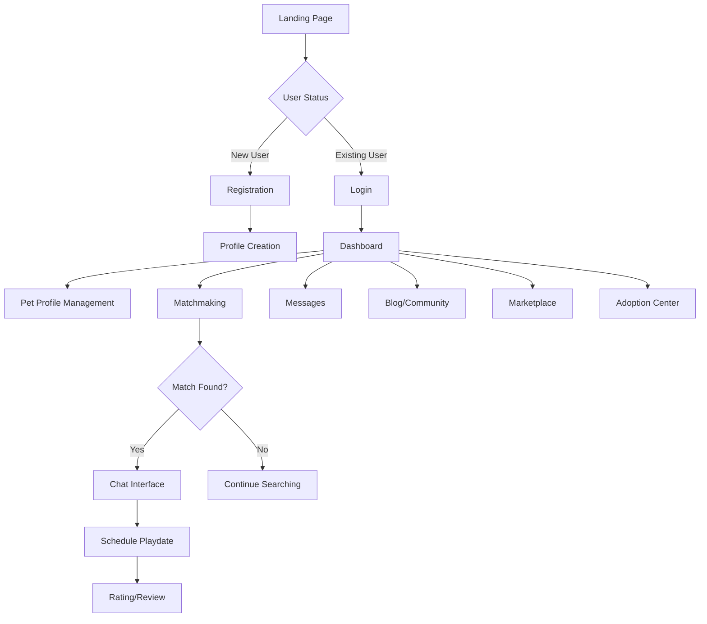

# Pet Matchmaking Application Documentation

## Use Cases

### 1. User accessing the website / User Authentication
- **As a new user:**
  - Register using email/password
  - Register using Google/Facebook
  - Verify email address
  - User clicks the "Sign Up" button.
  - Create initial profile
  - System redirects the user to the Dashboard / Profile.
- **As a registered user:**
  - Log in using email/password
  - Log in using Google/Facebook (optinal)
  - Reset forgotten password
### 2. Profile Management
- **As a pet owner:**
  - Create pet profile(s)
  - Upload pet photos
  - Edit pet information
  - Update availability status
  - Manage profile visibility
  - Set location preferences
  - Update personal information

### 3. Pet Matchmaking
- **As a pet owner seeking playmates:**
  - Set search criteria
  - View potential matches
  - Filter matches by location/species/age
  - Send match requests
  - Accept/reject incoming requests
  - Schedule playdates
  - Rate past interactions

### 4. Communication
- **As a matched user:**
  - Send direct messages
  - Share photos in chat
  - Block/report users
  - Set chat preferences
  - Schedule meetups
  - Share location for meetups

### 5. Content Management
- **As a community member:**
  - Create blog posts
  - Comment on posts
  - Share experiences
  - Upload photos/videos
  - Rate and review services
  - Report inappropriate content

### 6. Adoption Platform
- **As a shelter/individual:**
  - List pets for adoption
  - Upload pet documentation
  - Manage adoption listings
  - Process adoption requests
- **As an adopter:**
  - Browse available pets
  - Filter adoption listings
  - Contact pet owners/shelters
  - Save favorite listings

### 7. Marketplace Interaction
- **As a seller:**
  - List products/services
  - Manage inventory
  - Process orders
  - Respond to inquiries
- **As a buyer:**
  - Browse products/services
  - Place orders
  - Leave reviews
  - Track order status

## Application Flow



## Technical Implementation Details

### Frontend Structure
```
/public
  ├── index.html
  ├── css/
  │   ├── style.css
  │   ├── components/
  │   └── pages/
  ├── js/
  │   ├── app.js
  │   ├── router.js
  │   ├── components/
  │   └── services/
  └── assets/
      ├── images/
      └── icons/
```

### Backend Structure
```
/server
  ├── server.js
  ├── config/
  ├── routes/
  ├── controllers/
  ├── models/
  ├── middleware/
  └── utils/
```

### API Endpoints

1. Authentication
```
POST /api/auth/register
POST /api/auth/login
POST /api/auth/logout
PUT /api/auth/reset-password
```

2. Profile Management
```
GET /api/profile/:userId
PUT /api/profile/:userId
POST /api/profile/pet
PUT /api/profile/pet/:petId
```

3. Matchmaking
```
GET /api/matches
POST /api/matches/request
PUT /api/matches/:matchId
GET /api/matches/filter
```

4. Communication
```
GET /api/messages
POST /api/messages
GET /api/messages/:chatId
```

5. Content
```
GET /api/posts
POST /api/posts
PUT /api/posts/:postId
DELETE /api/posts/:postId
```

### Security Considerations
- JWT for authentication
- Input validation
- XSS protection
- CORS configuration
- Rate limiting
- Data encryption
- Secure file upload handling

### Performance Optimization
- Image compression
- Lazy loading
- Caching strategies
- Pagination
- Database indexing
- Asset minification
